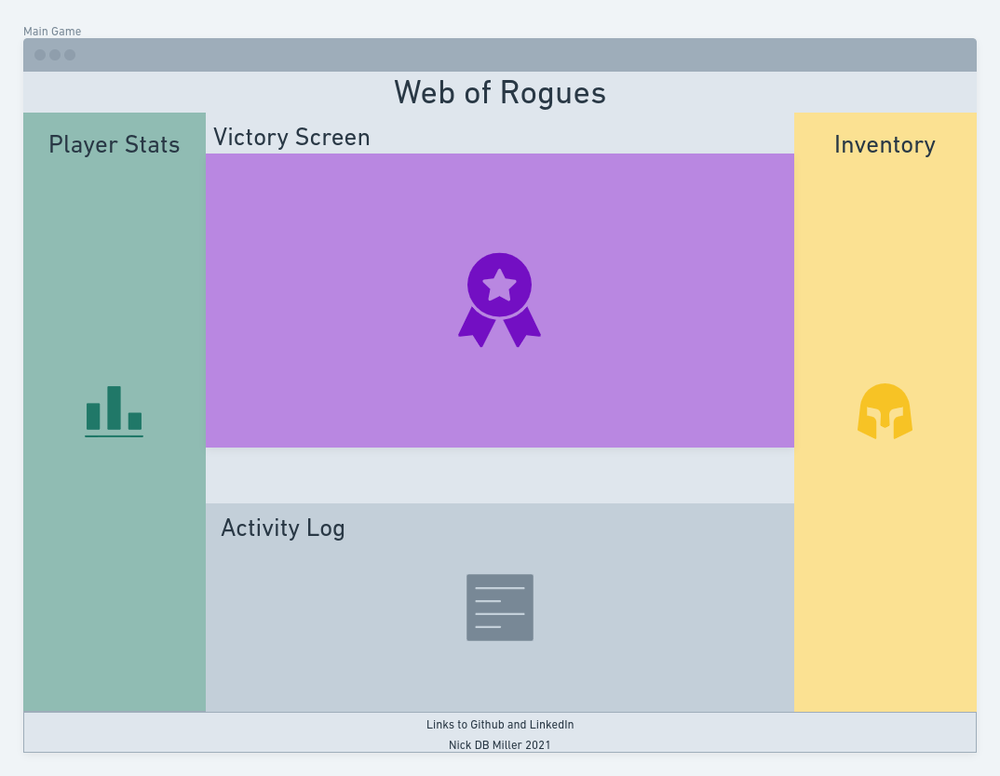
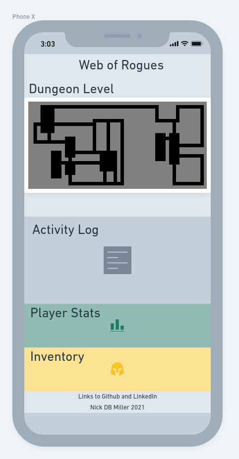

# [**_Web of Rogues_**](https://nickdbmiller.github.io/Web-of-Rogues-Game/)

## Project Description

This project is a browser based *rogue-like* game. The game consists of procedurally generated levels of a "dungeon." The player will have to fight monsters and avoid traps to reach the end and win the game!


###### Gif generated with Peek

## API and Data Sample

This project uses [Roguelike Web API](https://roguelike.docs.apiary.io/) for procedural dungeon generation.

The response data from the API returns an array of ones and zeros, with specifications for the dimensions of "rooms" and "corridors" below:
```
{
    "map": [
        [
            1,
            1,
            1,
            1,
            1,
            1,
            1,
            1,
            1,
            1,
            1,
            1,
            1,
            1,
            1,
            1,
            1,
            1,
            1,
            1,
            1,
            1,
            1,
            1,
            1
        ], "... This continues on for about a thousand lines."

    "_width": "25",
    "_height": "80",
    "_rooms": [
        {
            "_x1": 19,
            "_y1": 29,
            "_x2": 21,
            "_y2": 33,
            "_doors": {
                "19,28": 1,
                "20,34": 1
            }
        },
        {
            "_x1": 9,
            "_y1": 9,
            "_x2": 14,
            "_y2": 13,
            "_doors": {
                "15,13": 1
            }
        },
        {
            "_x1": 14,
            "_y1": 20,
            "_x2": 19,
            "_y2": 24,
            "_doors": {
                "14,19": 1,
                "19,25": 1
            }
        },
        {
            "_x1": 16,
            "_y1": 11,
            "_x2": 18,
            "_y2": 15,
            "_doors": {
                "15,13": 1,
                "15,15": 1
            }
        }, "...This also continues on for quite some time."
```
> All this looks like nonsence, but when formatted properly we begin to see how this could be used for making complex dungeons. [See this example of a live site using this API.](http://rogue-api.herokuapp.com)

## Wireframes

#### Main Game


#### Victory Screen


#### Defeat Screen


#### Mobile Layout Vertical

###### [Wireframes created with Whimsical](https://whimsical.com/) 

## MVP/PostMVP
#### MVP
- Uses [Roguelike Web API](https://roguelike.docs.apiary.io/) for procedural level generation
- Uses `Flexbox` styling to maintain page layout on different page sizes
- Uses media query to respond to vertical mobile page size
- Displays header with title of game, and footer with links to gitHub and LinkedIn
- Renders in *ASCII Style* graphics
- Player character ("PC") moves
- Takes arrow key input from user to move PC up, down, left, and right
- On finding the "staircase" PC will move to next level
- Displays health stat, points and simple inventory for PC
- Displays activity log for PC actions (eg. "You move West.")
- Displays current level
- When PC reaches staircase on level 10 win condition is met, the activity log announces victory, and dungeon level is replaced with a victory screen

#### PostMVP
- Add horizontal view for mobile
- Enemies use simple AI pathing to move toward and "attack" PC
- When PC health reaches zero the activity log anounces death and dungeon level is replaced with a defeat screen
- Use local storage to save game data
- Add main menu screen to manage saved games, start new games, and hall of champions
- Make the game increase in difficulty as the dungeon level increases
- Add additional PC classes (Wizard, Ranger, Fighter, etc.)
- Add items that the PC can pick up and interact with
- Add spells
- Add additional enemy types
- Add animations
- Add a leveling system so the PC can become stronger
- Add a requirement to fight your way back out of the dungeon to win
- Add a postgame where you can go deeper into the dungeon to increase your score

## Project Schedule

|  Day | Deliverable | Status
|---|---| ---|
|Dec 10-12| Prompt / Wireframes / Priority Matrix / Timeframes | Complete
|Dec 13| Project Approval / Core HTML, CSS / Pseudocode / Footer Links | Complete
|Dec 14| API setup / Mobile Layout / PC JS logic | Complete
|Dec 15| JS for game log and game state | Complete
|Dec 16| At least MVP / PMVP and further CSS polish as time allows | Incomplete
|Dec 17| Presentations | Incomplete

## Priority Matrix


###### [Priority matrix created with Whimsical](https://whimsical.com/) 

## Timeframes

| Component | Priority  | Estimated Time    | Curently Invested | Actual Time   |
| ---       | :---:     |  :---:            | :---:         | :---:         |
| Core HTML, CSS | H    | 3hrs              | 2 hrs         | 2 hrs         |
| Setup Flexbox  | H    | 3hrs              | 1 hrs         | 1 hrs        |
| Pseudocode JS  | H    | 3hrs              | 2 hrs         | 2 hrs        |
| Footer Links   | L    | 1hrs              | 0.25 hrs         | 0.25 hrs        |
| Setup API to display on Page | H | 3hrs   | 5 hrs         | 5 hrs        |
| Impliment Media Query | H    | 3hrs       | 1 hrs         | 1 hrs        |
| Ensure Layout Ports to Mobile | H | 3hrs  | 4 hrs         | 4 hrs        |
| In Game Objects | H    | 3hrs              | 3 hrs         | 3 hrs       |
| JS logic for PC | H   | 3hrs              | 6 hrs         | 6 hrs        |
| JS logic for AI | H   | 3hrs              | 0 hrs         | X hrs        |
| JS logic for game log | H | 3hrs          | 1 hrs         | 1 hrs        |
| JS logic for game state | H | 3hrs        | 0.5 hrs         | 0.5 hrs        |
| Styling for Win/Lose | M    | 3hrs              | 1 hrs         | 1 hrs         |
| Finalize Styling   | M | 3hrs          | 0 hrs         | X hrs        |
| Total     |           | 40hrs             | 26.75hrs          | X hrs        |

## Code Snippet

These two functions are how objects are rendered in the dungeon randomly each time it is generated. First a list of floor tiles is generated...

```
let currentPlayerPos = null;
let currentStairPos = null;
let floorTiles = [];

function listFloorTiles () {
    for (let r = 1; r <= (dungeonHeight*dungeonWidth); r++) {
        let thisTile = document.getElementById(`-${r}`);
        if (thisTile.className == `floor`) {
            floorTiles.push(`-${r}`);
        };
    };
    return floorTiles;
};
```
>...Then the stairs are put on a random floor tile (using a RNG function declared elsewhere in the script). The tile will always be different than the floor tile the PC is put on to prevent overwriting.
```
function renderStairs () {
    let position = `${floorTiles[RNG(0, (floorTiles.length-1))]}`;
    let tile = document.getElementById(`${position}`);
    currentStairPos = position;
    if (currentPlayerPos == currentStairPos) {
        while (currentPlayerPos == currentStairPos) {
            position = `${floorTiles[RNG(0, (floorTiles.length-1))]}`;
            tile = document.getElementById(`${position}`);
            currentStairPos = position;
        }
        tile.innerText = `>`;
    } else {
        tile.innerText = `>`;
    };
};
```

## [Change Log](https://github.com/nickdbmiller/Web-of-Rogues-Game/commits/main)